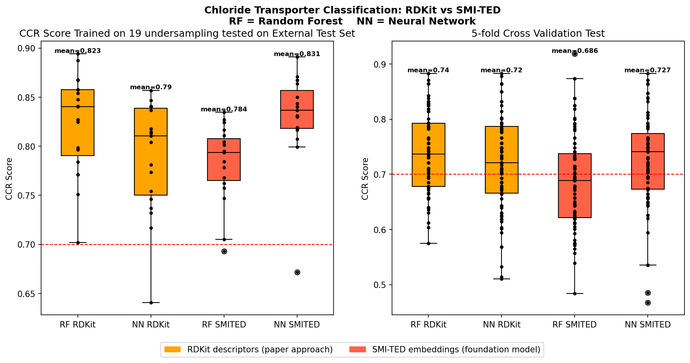

# RDKit Descriptor vs IBM's SMI-TED Foundation Model in predicting potential chloride transporter therapeutics

# Motivation 
Inspired by the paper “Development of Synthetic Chloride Transporters Using High-Throughput Screening and Machine Learning" by Chowdhury et al. in Digital Discovery (2025), where they obtain a 1500 compounds of potential therapeutics for cloride transporter disease (diseases linked to dysfunctional chloride transport, 
such as cystic fibrosis and Bartter syndrome) and classified them as active and inactive. RDKit to generate physicochemical descriptors to trained machine learning models to predict which molecules would be potential active chloride transporter therapeutics. 

The combination of a comprehensive experimental-derived data set, multiple undersampling techniques to improve bias, and a consensus machine learning model makes this study compelling for me to replicate and improve upon. 

Foundation model has been gaining traction in recent years as it is a model that is trained on a large, unlabeled data set that can be used to build diverse downstream application.  

Chowdhury et al. used RDKit to generate physicochemical descriptors 
as molecular features. In this project, I hypothesize that the learned representations 
from foundation models such as SMI-TED capture richer molecular 
information than traditional cheminformatics descriptors, 
potentially improving classification performance.
# Research Question 
Does IBM's SMI-TED foundation model improve on the Chowdhury et al.'s  
RDKit descriptor approach for predicting chloride transport activity?
# Method 
## Data set 
- Training set: 1348 compounds (54 active, 1294 inactive)
- Test: 175 compounds (30 active, 145 inactive)
The molecules in the data set was in SMILES representation. As the the number of active compound was significantly smaller than the inactive compound, Chowdhury et al. divided the inactive compound in the training set into 19 subset and then append the active compound into those subsets (undersampling technique).This project obtain the orgninal data set from Chowdhury et al. and reproduced the 19 subsets using the undersampling technique.

## Reproduce  Chowdhury et al. result 
Chowdhury et al. used random forest (RF), support vector machine (SVM), extreme gradient boosting (XGB) and neural network with the RDKit descriptor input and run a 5-fold cross-validation test to benchmark the model performance, resulting in an average correct classification rate (CCR) 0.711 across all model. This project reproduced the RDKit descriptor and RF and NN model cross-validation results as 
representatives of tree-based and neural network approaches respectively.
## SMI-TED embeddings
SMI-TED (SMILES-based Text Encoder-Decoder) is IBM's molecular 
foundation model, pretrained on 91 million SMILES strings. It encodes 
each molecule as a 768-dimensional vector that captures learned 
molecular representations beyond hand-crafted physicochemical 
descriptors. I obtained the SMI-TED embeddings by setting up the 
appropriate conda environment following the 
[IBM notebook instructions](https://github.com/IBM/materials/blob/main/examples/battery_example.ipynb).

# Results and Dicussion 

## Part 1: Cross-Validation Results and Replication of Figure 3

To replicate Chowdhury et al.'s evaluation, a 5-fold cross-validation 
was performed on each of the 19 undersampling subsets, producing 95 CCR 
scores per classifier (RF or NN). This mirrors the 
evaluation shown in Figure 3 of the paper.

| Model | Feature Set | CV Mean CCR | CV Min | CV Max |
|-------|-------------|-------------|--------|--------|
| Random Forest | RDKit | 0.7395 | 0.5747 | 0.8831 |
| Neural Network | RDKit | 0.7198 | 0.5105 | 0.8831 |
| Random Forest | SMI-TED | 0.6864 | 0.4838 | 0.9188 |
| Neural Network | SMI-TED | 0.7268 | 0.4675 | 0.8831 |

**Comparison to paper:**
Chowdhury et al. reported an average CCR of 0.711 across all RDKit 
models (RF, SVM, XGB, DNN). This RDKit replication achieves a comparable 
RF cross-validation CCR of 0.7395 and NN of 0.7198, both consistent 
with the paper's reported range.

Notably, SMI-TED embeddings showed lower cross-validation performance 
than RDKit descriptors (RF: 0.6864 vs 0.7395), suggesting that 
RDKit descriptors generalize more consistently across different 
training subsets.



---

## Part 2: RDKit vs SMI-TED Comparison on External Test Set

The paper reports only the consensus model CCR on the external test 
set (0.842), without individual model results. This project evaluated 
RF and NN classifiers independently on the same external test set, 
enabling a direct comparison between RDKit descriptors and SMI-TED 
embeddings.

| Model | RDKit CCR | SMI-TED CCR | Better feature set |
|-------|-----------|-------------|-------------------|
| Random Forest | **0.8232** | 0.7842 | RDKit |
| Neural Network | 0.7896 | **0.8311** | SMI-TED |

**Key observations:**

1. **RF performs better with RDKit descriptors** (0.8232 vs 0.7842) 
   — hand-crafted physicochemical descriptors suit tree-based models 
   that select which features matter most through feature importance.

2. **NN performs better with SMI-TED embeddings** (0.8311 vs 0.7896) 
   — dense 768-dimensional learned representations suit neural networks 
   that can extract nonlinear patterns from high-dimensional input.

3. **The best result (NN + SMI-TED, 0.8311) slightly outperforms 
   the best paper-approach result (RF + RDKit, 0.8232)**, suggesting 
   foundation model embeddings add value when paired with the 
   appropriate classifier.

4. **External test set scores (0.78-0.83) are notably higher than 
   cross-validation scores (0.69-0.74)** — consistent with the 
   paper's observation that the external test set contains previously 
   published chloride transporters that may be more structurally 
   distinct and easier to classify correctly.

# Conclusion 
This project successfully replicated the RDKit descriptor-based machine learning pipeline from Chowdhury et al. 2025, achieving a cross-validation CCR of 0.7395 for Random Forest, consistent with the paper's reported average CCR of 0.711.

The initial research question of whether SMI-TED foundation model embeddings improve on the RDKit descriptor approach, yields a nuanced answer. 

**SMI-TED embeddings improve performance when paired with a Neural Network 
(0.8311 vs 0.7896), but not when paired with Random Forest (0.7842 vs 0.8232).**

This suggests that model-feature compatibility is a critical factor in molecular property prediction. RDKit descriptor has interpretable, low-dimensional physicochemical feature and are better suited to tree-based models that select features explicitly. SMI-TED embeddings has dense, 
768-dimensional learned representations and are better suited to neural networks capable of extracting nonlinear patterns from high-dimensional input. However, the improvement is modest (0.8311 vs 0.8232 at best), suggesting that for small imbalanced datasets like this one (~54 active compounds), foundation model embeddings may not provide a substantial advantage over well-chosen physicochemical descriptors

These findings are consistent with recent literature showing that foundation model embeddings paired with appropriate neural architectures can outperform 
traditional descriptor-based approaches such Green et al.'s paper "Descriptor-based Foundation Models for Molecular Property Prediction" in 2025.

### Limitations

- Only RF and NN were tested. The paper also used SVM and XGB, 
  which may interact differently with SMI-TED embeddings
- The dataset is small (~1348 training compounds, only 54 active). Foundation models typically show larger advantages on bigger datasets
- A consensus model combining both RDKit and SMI-TED predictions 
  was not tested. This may further improve performance

### Future Work
- Test SVM and XGB with SMI-TED embeddings 
- Build a consensus model averaging RDKit and SMI-TED predictions
- Apply the model to screen larger compound libraries for novel 
  chloride transporter candidates
# Reference 
(1) Chowdhury, S. M.; Daood, N. J.; Lewis, K. R.; Salam, R.; Zhu, H.; Busschaert, N. Development of Synthetic Chloride Transporters Using High-Throughput Screening and Machine Learning. Digital Discovery 2025, 4 (9), 2615–2626. https://doi.org/10.1039/d5dd00140d

(2) Burns, J. W.; Zalte, A. S.; Green, W. H. Descriptor-Based Foundation Models for Molecular Property Prediction. Preprint 2025. https://arxiv.org/abs/2506.15792v1

# How to Navigate This Repository
## To understand this project
Start with the **paper**: [Chowdhury et al. 2025](https://doi.org/10.1039/d5dd00140d)  
Then read `README.md` (this file) for how this project extends it.

## To understand the code

| File | What it does |
|------|-------------|
| `src/config.py` | Reads `config.yaml` and resolves file paths |
| `src/data.py` | Loads CSV files and creates 19 undersampling splits |
| `src/features.py` | Computes RDKit descriptors and SMI-TED embeddings |
| `src/models.py` | Trains RF and NN classifiers, runs cross-validation |
| `src/metrics.py` | Computes CCR (correct classification rate) |
| `example_run_ipynb` | Runs the full experiment from loading data to producing the final comparison figure|

## To replicate this project
## Environment Setup

This project requires two separate setups:
1. The conda environment for running the ML pipeline
2. The IBM materials repository for SMI-TED embeddings

---

### Step 1 — Install Anaconda

If you don't have Anaconda installed:
- Download from [anaconda.com](https://www.anaconda.com/download)
- Follow the installation instructions for your operating system

---

### Step 2 — Create the conda environment

```bash
# Create a new environment with Python 3.9
conda create -n cl-transporter-env python=3.9

# Activate it
conda activate cl-transporter-env
```

---

### Step 3 — Install dependencies

**Install in this exact order to avoid conflicts:**

```bash
# 1. Install rdkit via conda first (must come before pip installs)
conda install -c conda-forge rdkit=2024.03.5

# 2. Install PyTorch
pip install torch==2.3.1

# 3. Install all remaining dependencies
pip install -r requirements.txt
```

Where `requirements.txt` contains:

```
# Core ML and chemistry
numpy==1.26.4
pandas==2.3.3
scikit-learn==1.6.1
matplotlib==3.9.2
xgboost==2.1.4
pyyaml==6.0.2
jupyterlab==4.3.0

# SMI-TED foundation model
transformers==4.55.2
tokenizers==0.21.4
safetensors==0.6.2
huggingface_hub==0.34.4
datasets==3.6.0
selfies==2.2.0
torch-scatter==2.1.2
torch-sparse==0.6.18

# Supporting
scipy==1.13.1
joblib==1.5.2
tqdm==4.67.1
pyarrow==17.0.0
pytest==8.4.2
```


---

### Step 4 — Clone this repository

```bash
git clone https://github.com/ephan04/Cl-Transporter.git
cd Cl-Transporter
```

---

### Step 5 — Set up IBM materials repository (for SMI-TED only)

SMI-TED is not a pip-installable package — it lives inside IBM's
materials repository. Clone it **next to** this project folder,
not inside it:

```bash
# Navigate to the parent folder
cd ..

# Clone IBM's repo
git clone https://github.com/IBM/materials.git
```

Your folder structure should look like this:

```
your-folder/
├── Cl-Transporter/    ← this project
└── materials/         ← IBM's repo
```

Then download the SMI-TED model weights from HuggingFace:

```bash
python -c "
from huggingface_hub import hf_hub_download
hf_hub_download(
    repo_id='ibm-research/materials.smi-ted',
    filename='smi_ted_light.pt',
    local_dir='materials/models/smi_ted/inference/smi_ted_light/'
)
print('Weights downloaded successfully.')
"
```

---

### Step 6 — Add your data files

Obtain `training.csv` and `test.csv` from the supplementary material
of Chowdhury et al. 2025 (Table S2):
[https://doi.org/10.1039/d5dd00140d](https://doi.org/10.1039/d5dd00140d)

Place them in the `data/` folder:

```
Cl-Transporter/
└── data/
    ├── training.csv
    └── test.csv
```

---

### Step 7 — Verify setup

Run this to confirm all key packages are installed correctly:

```bash
python -c "
import numpy, pandas, sklearn, rdkit, torch, yaml, matplotlib, xgboost
print(f'numpy:      {numpy.__version__}')
print(f'pandas:     {pandas.__version__}')
print(f'sklearn:    {sklearn.__version__}')
print(f'rdkit:      {rdkit.__version__}')
print(f'torch:      {torch.__version__}')
print(f'matplotlib: {matplotlib.__version__}')
print(f'xgboost:    {xgboost.__version__}')
print()
print('All packages verified.')
"
```

---

### Step 8 — Run the notebook

```bash
# Make sure your environment is activated
conda activate cl-transporter-env

# Open Jupyter
jupyter notebook notebooks/example_run.ipynb
```

In VS Code: open `notebooks/example_run.ipynb` and select
`cl-transporter-env` as the kernel in the top right corner.

---

### Troubleshooting
**`python3` uses the wrong Python**  
Always use `python` (not `python3`) after activating the conda
environment. Verify with:
```bash
which python
# Should show a path containing cl-transporter-env
```

**SMI-TED cells are very slow on first run**  
This is expected — the model loads and computes embeddings for
all 19 subsets. Results are cached automatically to `results/`
as `.npy` files after the first run. Subsequent runs load from
cache and complete in seconds.

**`fm4m` not found**  
Make sure the IBM `materials/` repository is cloned next to
(not inside) your project folder, and that `config.yaml` has
the correct paths:
```yaml
external:
  fm4m_root: "../materials"
  fm4m_dir:  "../materials/models"
```

**`torch-scatter` or `torch-sparse` installation fails**  
These packages depend on your specific PyTorch version. If the
pip install fails, try installing from the PyG wheel index:
```bash
pip install torch-scatter torch-sparse \
  -f https://data.pyg.org/whl/torch-2.3.1+cpu.html
```